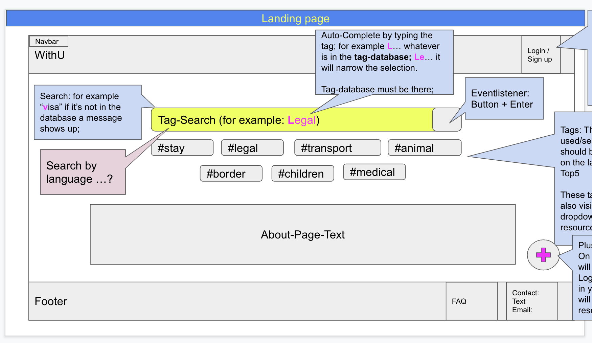
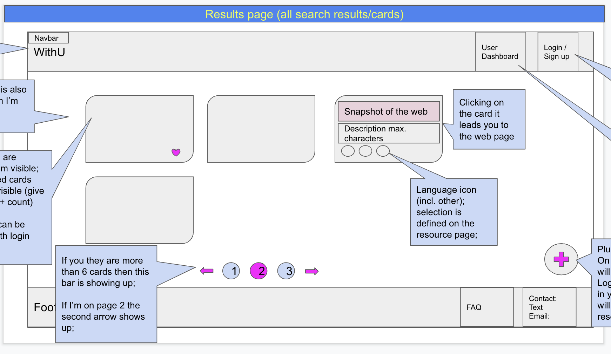
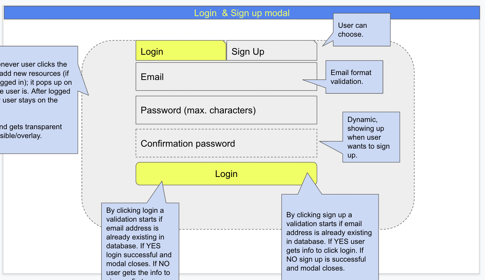
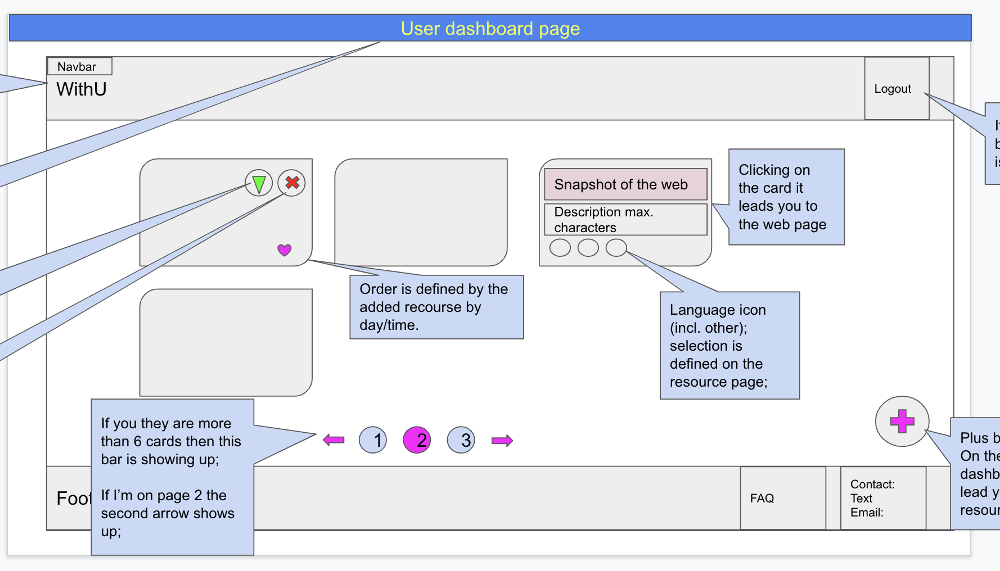
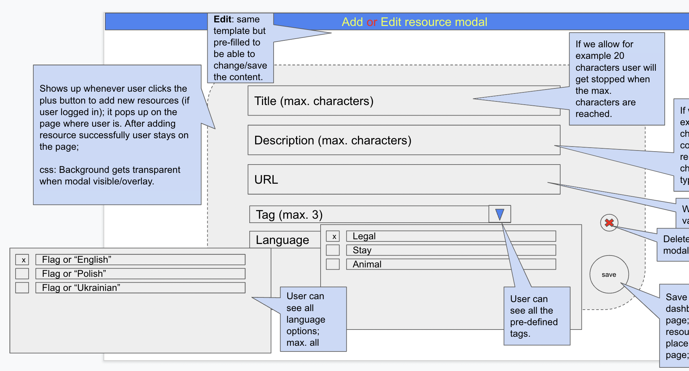
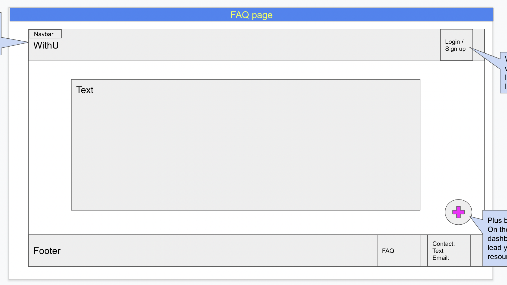

<div ><a href="........"></a></div>

<br>
<h1> WithU </h1>


Crowdsourced information platform as a MERN stack single-page application.
<br>
<br>

<h2>Table of Content</h2>

- [Project Link](#project-link)
- [Getting Started](#getting-started)
- [Contributors](#contributors)
- [About The project](#about-the-project)

  - [Key Features](#key-features)
  - [User Story](#user-story)
  - [Technologies Used](#technologies-used)
  - [Wireframes](#wireframes)

- [Plans For Improvement](#plans-for-improvement)
- [Screenshots](#screenshots)

  - [Homepage](#homepage)
  - [Results Page](#results-page)
  - [Sign In/ Sign Up](#sign-in-sign-up)
  - [User Dashboard](#user-dashboard)
  - [Contact](#contact)
  - [FAQ](#faq)

<br>

### Project Link

[Link](https://) to our live app.
These are our project's [presentation](https://docs.google.com/presentation/d/1T8Ap8jjG7QYzMlNbsrQl5TnSuf05T5OFhGCes8wt5zc/edit#slide=id.g11e6c9f5e49_0_67) and our [GitHub repo](https://github.com/Amir-Fard2025/WithU/tree/dev).

<br>

### Getting Started

This is a live website, therefore accessible directly on its [live URL](https://).
Should you like to experiment and check the code, feel free to clone the repo to your local machine and open the project in your VSCode:

```
git clone git@github.com:Amir-Fard2025/WithU.git
cd WithU
code .
```

Install all dependencies by typing in the terminal:

`npm i`

Seed data in the database and start the app by running:

`npm run start`

<br>

### Contributors

- Amir : https://github.com/Amir-Fard2025
- Jenny : https://github.com/JenBerlin
- Jitka : https://github.com/jitasek
- Mohamed : https://github.com/mohamedallam13
- Olivier : https://github.com/zeitouna
- Vicente : https://github.com/vvicunag

<br>

### About The Project

`WithU is a crowdsourced information platform aggregating resources that have been created to provide any kind of support to people affected by the war in Ukraine. It is meant for users who are seeking information, assistance or help as war refugees, their relatives, friends, or whoever else actively involved. Users can also create an account and actively add new useful resources to the platform. The resources are sorted into categories and can be also searched by respective tags. They can as well be ranked by other users.`

<br>

### Key Features

- user sign-up, login, logout
- view dashboard with resources
- search field that generates a result page
- view dashboard with all resources added by a user
- from the dashboard, user can:
  - create, view, update, delete resources
- password hashing
- username and password validation
- ranking functionality
- password verification during sign-up

<br>

#### User Story

```md
As an ordinary human being, I want to contribute to making it easier for the innocent civilians fleeing the war to orientate themselves in countries providing asylum and to reach the needed support and help.
```

<br>

#### Technologies Used

<p>The following technologies and frameworks were used while working on this project:</p>

- `HTML`, `CSS` (`Material UI` Framework)
- `React`, `JavaScript`
- `npm` package manager
- `Express.js`
- `Node.js`
- `MongoDB` and `Mongoose ODM`
- `GraphQL`
- `apollo-server-express`
- `Heroku`
- `bcrypt` package
- `dotenv` package
- `Insomnia API Design Platform`
- `eslint`, `nodemon` (dev dependencies)
- authentication (`JWT`)

<br>

#### Wireframes

- Homepage 

- Results Page 

- Sign In/ Sign Up 

- User Dashboard 

- Add/ Edit Resource 

- FAQ 

<br>

### Plans For Improvement

- developing a mobile app
-
-
-
-
-

<br>

### Screenshots

- #### Homepage

  

- #### Results Page

  

- #### Sign In/ Sign Up

  

- #### User Dashboard

  

  - #### Contact

  

- #### FAQ

  
